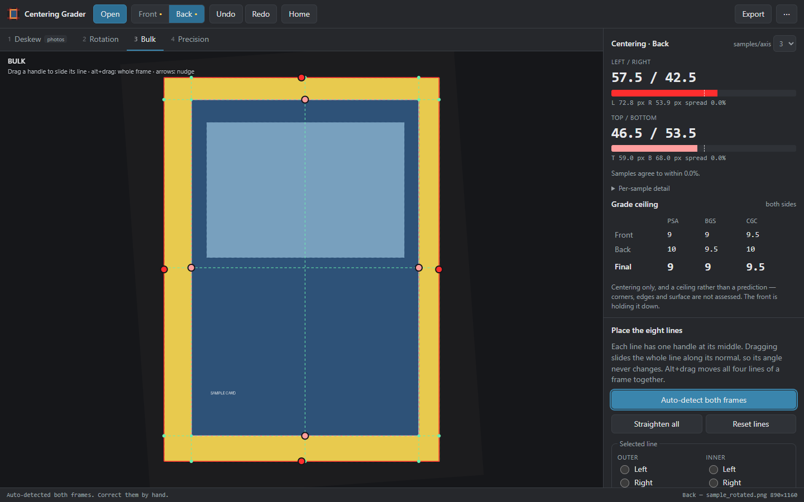
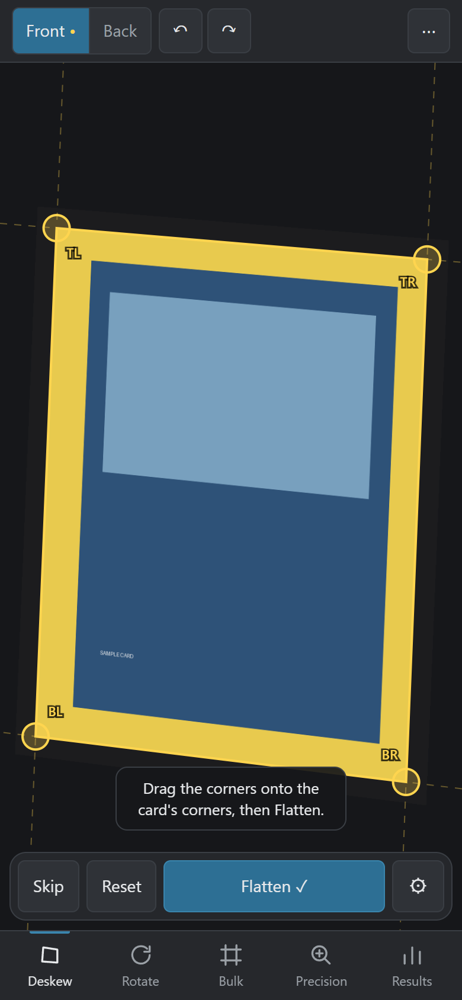
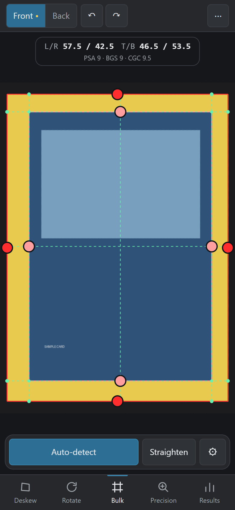
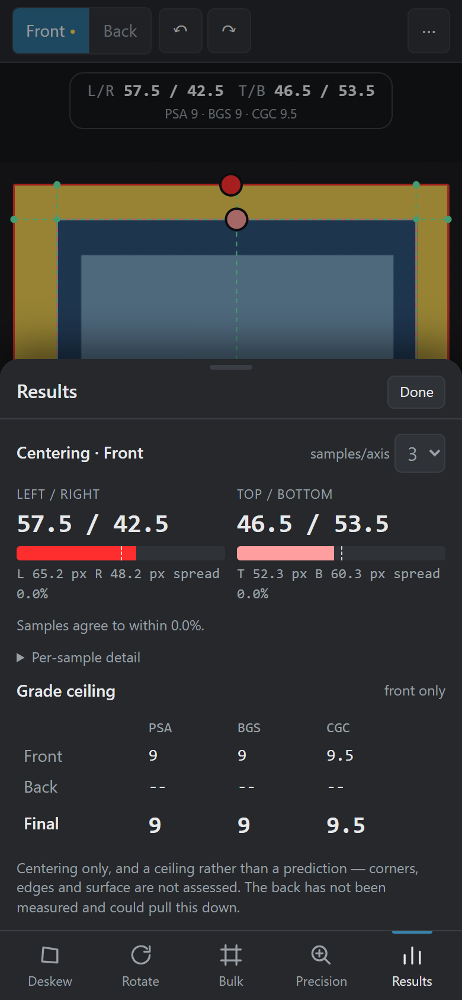
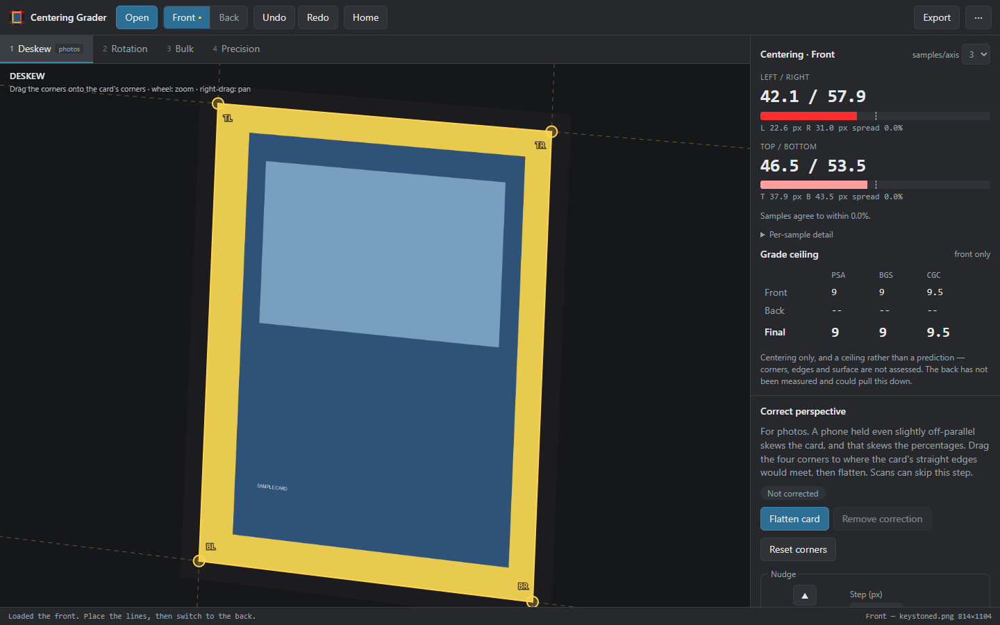
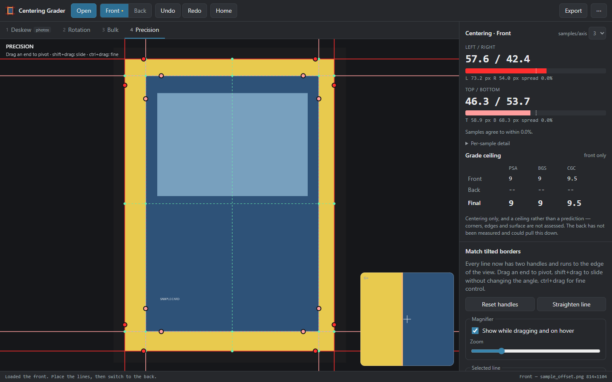
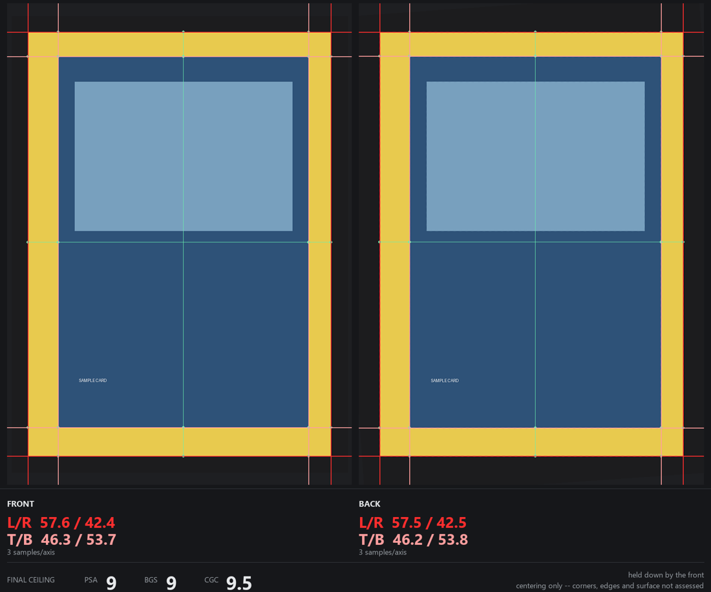

# Card Centering Grader

[](https://github.com/william-geary/card-centering-grader/actions/workflows/tests.yml)
[](LICENSE)

Measure the centering of a trading card, front and back, and see the best grade
that centering still allows.

**[Open it in your browser](https://william-geary.github.io/card-centering-grader/)** — works on Windows, Mac,
iPhone, iPad and Android, nothing to install. Or get the
**[desktop app](https://github.com/william-geary/card-centering-grader/releases/latest)** for Windows or Mac.



You place eight lines over a scan or photo — four on the card's edge, four on
the inside edge of the printed border — and it reports Left/Right and
Top/Bottom centering as you work, averaged over several sample points per axis.

It is manual on purpose. Automatic edge detection is fine on a clean scan and
wrong in exactly the cases that matter: a dark border on a dark background, a
holo pattern that reads as an edge, a print tilted inside a straight cut. You
get an auto-detected starting point, then put every line where you judge it
belongs, with a magnifier to seat it on the pixel.

**Your images never leave your device.** There is no server: everything runs
in the browser or the desktop app.

---

## Getting it

### In the browser

**https://william-geary.github.io/card-centering-grader/**

To keep it on a phone like an app, with offline use:

- **iPhone / iPad** — open it in Safari → Share → **Add to Home Screen**.
- **Android** — open it in Chrome → menu → **Install app**.

On a phone the card fills the screen, with the stages along the bottom. **Take a
photo** opens the camera, and the photo goes straight to **Deskew** with the
corners already placed on the detected card. Tap the numbers above the card for
the full results.

<p>
  
  
  
</p>

For the best photo: lay the card flat on a plain dark surface, hold the phone
directly above it so the card fills the frame, and avoid glare.

### Desktop app

From the [latest release](https://github.com/william-geary/card-centering-grader/releases/latest):

| Computer | File |
|---|---|
| Windows 10 / 11 | `…-windows-x64-setup.exe` (installs) or `…-windows-x64-portable.exe` (just runs) |
| Mac, Apple Silicon or Intel | `…-macos-universal.dmg` |

The apps are not code-signed, so both systems warn the first time.
**Windows:** More info → Run anyway. **Mac:** open it once, click Done, then
System Settings → Privacy & Security → **Open Anyway**. Full steps are in the
release notes.

---

## Using it

Open the front of the card, work through the stages, then switch to **Back**
and do the same. Try it first with **Try the sample card**.

### 1 · Deskew — for photos

A phone held even slightly off-parallel skews the card, and perspective does not
preserve distance ratios, so the percentages drift by a few points with no
warning. That is the gap between a PSA 10 and a 9.

Drag the four corner handles to where the card's straight edges would meet —
card corners are rounded, so the true corner is a virtual point, and dashed
extensions of each edge help you line it up. **Flatten card** warps the photo
to a rectangle before any lines are placed. Scans from a flatbed scanner can
skip this stage. On a phone, **Skip** does that.



### 2 · Rotation

Straighten the card on screen. Drag to rotate (two-finger twist on touch), use
the wheel or pinch to zoom, right-drag or one finger to pan; there are exact
controls in the panel. **Home** (`H`) centres the card and fills the view with
it.

Rotation and zoom never change the numbers — centering is a ratio of
distances, which rotation and uniform scaling preserve exactly. What they do
change is everything afterwards: lines and auto-detection work in the frame you
are looking at, so a crooked scan straightened here gets squared lines and a
much better first guess.

### 3 · Bulk

Each line has **one handle at its midpoint**. Dragging it slides the whole line
along its normal, so the angle never changes. **Alt+drag** moves all four lines
of a frame together. Arrow keys nudge the selected line (shift ×0.2, ctrl ×5).

### 4 · Precision

Each line gets **two handles** and runs to the edge of the view, so you can
match a border printed at a slight angle. Drag an end to pivot, **shift+drag**
to slide without changing the angle, **ctrl+drag** for fine control. A
magnifier follows the handle you are dragging.



### Both sides and the grade ceiling

The **Front / Back** switch holds two independent measurements — each with its
own image, rotation, lines and undo history. Graders set a tolerance for each
face and a card must meet both, so the **Final** row follows whichever side
reads worse:

```
             PSA   BGS   CGC
   Front     9     9     9.5
   Back      10    9.5   10
   Final     9     9     9.5     ← the worse of the two, per grader
```

The note underneath names the side holding the grade down.

### Saving and sharing

- **Export → Overlay image** — both faces side by side, each cropped the way
  Home frames it, with the lines and a caption carrying the numbers. On a phone
  this opens the share sheet, so you can save it to Photos or send it.
- **Export → Report** — JSON with every percentage, pixel margin and
  per-sample value, plus all the line positions.
- **⋯ → Save session** — both images and all your lines in one file, to pick
  the card up again later, on any device.



### Keyboard

| Key | |
|---|---|
| `1`–`4` | Switch stage |
| `Ctrl+O` / `Ctrl+S` / `Ctrl+E` | Open image / save session / export image |
| `Ctrl+Z` / `Ctrl+Shift+Z` | Undo / redo |
| `H` / `F` | Home / fit the whole scan |
| `A` | Auto-detect |
| `S` | Show or hide the sample lines |
| Arrows | Nudge (shift ×0.2, ctrl ×5) |
| `?` | All shortcuts |

On a Mac, use `Cmd` for `Ctrl`.

---

## How the measurement works

Rather than one margin per side, it takes **N samples per axis** (3 by default,
up to 9) and averages them.

For left/right, with the inner frame's corners `TL`, `TR`, `BL`, `BR`:

```
        TL ------------------- TR
         |                      |
 t=0.0  A(t) ----- scan ----- B(t)      A(t) = lerp(TL, BL, t)  on the inner-left line
         |                      |       B(t) = lerp(TR, BR, t)  on the inner-right line
        BL ------------------- BR
```

The scan line through `A(t)` and `B(t)` is intersected with the outer-left and
outer-right lines. The left margin runs from that intersection to `A(t)`,
measured along the scan; the right margin from `B(t)` to the outer-right
intersection. Top/bottom is the same construction turned 90°.

```
L% = mean(left) / (mean(left) + mean(right)) × 100        R% = 100 − L%
```

With three samples they land on the two inner corners and the point midway.

**Why more than one sample.** If the frames are parallel, every sample agrees
and the count makes no difference. If they are not — a print tilted inside a
straight cut — the samples disagree, and that disagreement is the finding. A 4°
tilt averages to a perfect 50.0/50.0 while the samples read 70.7 / 50.0 / 29.3;
one sample would have called that card dead centre. The panel reports it as
**spread**, with the per-sample table underneath.

It also flags a **crossed** frame, where an outer line has been dragged inside
its inner line, since the percentages mean nothing until that is fixed.

### Accuracy, and what this is not

The tolerance tables in [`src/core/grades.ts`](src/core/grades.ts) are the
centering tolerances as commonly published, gathered in one place so you can
check them against what a grader currently states and edit them. Graders revise
their standards, and this project is not affiliated with PSA, Beckett or CGC.

The geometry is exact and covered by tests. What no tool like this can do is
tell you the grade a card will get: centering is one part, and corners, edges,
surface and print quality are the rest. Treat the numbers as a ceiling and a
sanity check before you pay for submission, not a verdict.

---

## Development

Needs [Node.js](https://nodejs.org/) 20+.

```
npm install
npm run dev              # the web app at http://localhost:1420
npm run typecheck
npm test                 # unit tests, and parity with the original Python app
npm run test:e2e         # the built app, driven in a real browser
npm run tauri dev        # the desktop app (needs Rust — see docs/RELEASING.md)
```

```
src/
  core/          measurement and image processing — no DOM, runs under Node
    geometry.ts    infinite lines, intersection, clipping
    transform.ts   image ↔ view mapping
    measure.ts     the multi-point centering engine
    grades.ts      tolerance tables and grade ceilings
    perspective.ts homographies and flattening photos
    raster.ts      resampling, rotation, warping, tint
    autodetect.ts  the first guess at both frames
    model.ts       one face of a card, with undo
    session.ts     front, back and the final verdict
    framing.ts     Home view and export crops
  ui/            the canvas, panels, exports
  platform/      opening and saving files: browser vs desktop
src-tauri/       the desktop shell
tests/
  parity.test.ts     must reproduce the Python app's numbers exactly
  behaviour.test.ts  the properties the app relies on
  e2e/               browser tests, and the README screenshots
```

### Parity with the original app

This began as a Python desktop app. `tests/fixtures` holds its outputs, frozen
before the rewrite, and `tests/parity.test.ts` requires the TypeScript version
to reproduce all of them: 220 measurements, every grade lookup, transforms,
handle placement and auto-detection — including a faithful port of Pillow's
fixed-point image resampling, because a few floating-point bits decide which of
two near-equal edges auto-detect picks. If a parity test fails, a card would
grade differently than it did before.

### Publishing

Pushing to `main` updates the website; pushing a version tag builds the desktop
apps. Step by step, for anyone new to GitHub: [docs/RELEASING.md](docs/RELEASING.md).

## Contributing

Issues and pull requests are welcome — especially corrections to the tolerance
tables, and bug reports with the image that caused them. Run `npm test` and
`npm run test:e2e` before opening a PR. If you change how measuring works, add
a test that would fail without your change.

After a visible UI change, `npm run docs:screenshots` regenerates the images in
this README.

## Licence

MIT — see [LICENSE](LICENSE).

Not affiliated with Nintendo, The Pokémon Company, PSA, Beckett or CGC.
