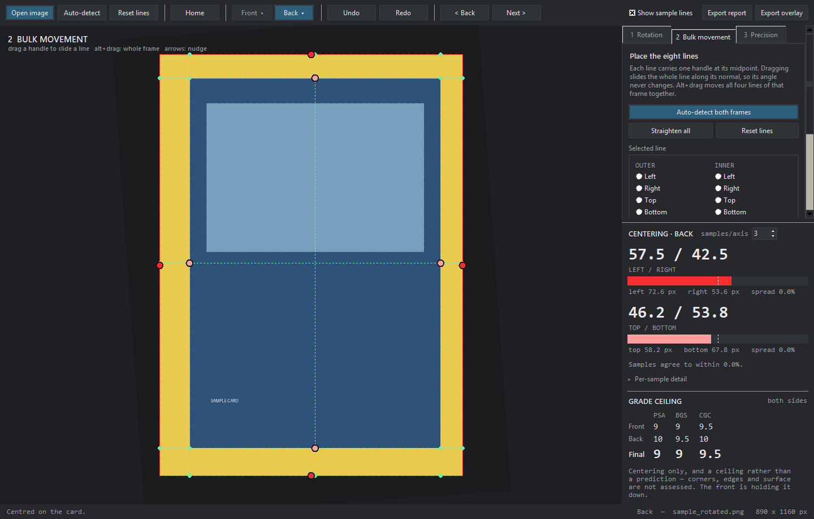
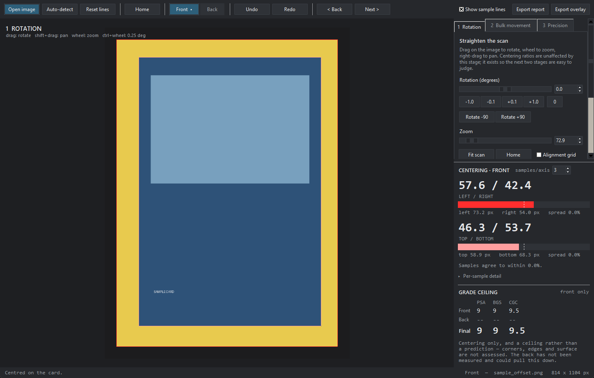
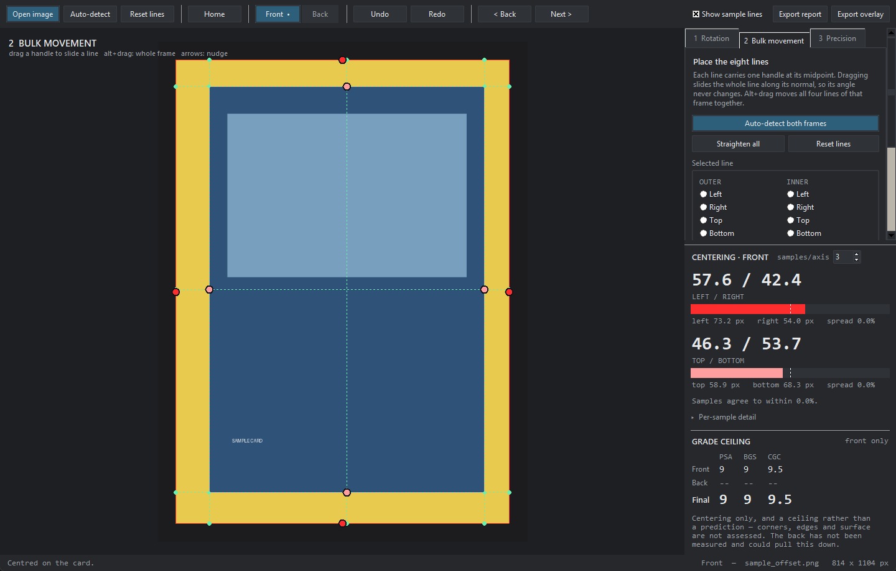
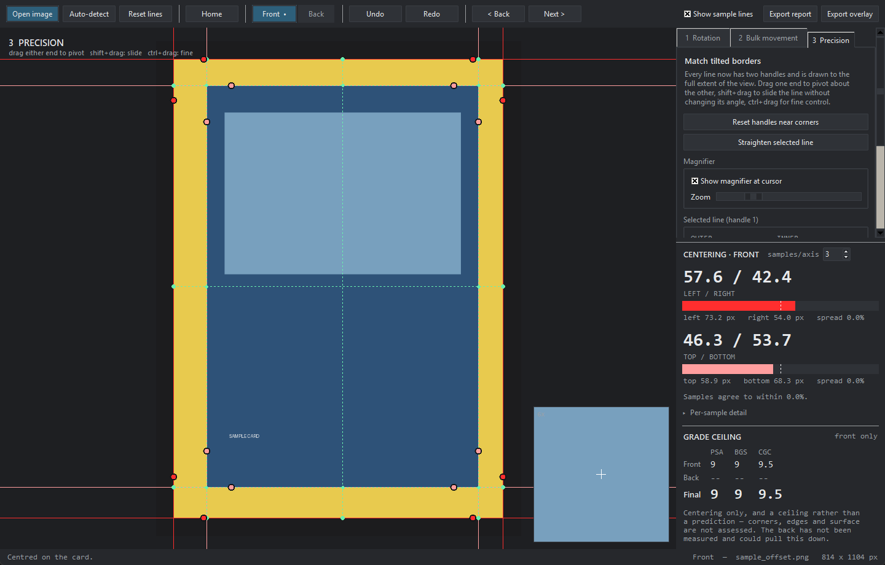

# Card Centering Grader

[](https://github.com/william-geary/card-centering-grader/actions/workflows/tests.yml)
[](LICENSE)

A manual centering tool for trading cards. You place eight boundary lines over
a scan — four for the card edge, four for the inside edge of the printed
border — and it reports Left/Right and Top/Bottom centering live, averaged over
several sample points per axis.

You measure **both faces** and it gives you one final grade ceiling, because
graders hold a card to a tolerance on each side.



Manual on purpose. Automatic edge detection is fine on a clean scan and wrong
in exactly the cases that matter — a dark border on a dark background, a
holo pattern that reads as an edge, a print tilted inside a straight cut. Here
you get an auto-detected starting point and then put every line where you
judge it should be, with a magnifier to seat it on the pixel.

```
python run.py                      # open empty
python run.py samples/sample_offset.png
```

Requires Python 3.9+, Pillow and numpy (`pip install -r requirements.txt`).
Tkinter ships with Python.

## Download

**[Get the latest release](https://github.com/william-geary/card-centering-grader/releases/latest)**
— nothing to install, and you do not need Python.

| Your machine | File |
|---|---|
| Windows 10 / 11 | `…-windows-x86_64.exe` |
| Mac, Apple Silicon (M1–M4) | `…-macos-arm64.zip` |
| Mac, Intel | `…-macos-x86_64.zip` |

Both platforms will warn you the first time, because the app is not
code-signed. On Windows: **More info → Run anyway**. On macOS you must
**right-click the app → Open** rather than double-clicking it — a plain
double-click gives a dead end. Once, then never again.

Prefer to run from source? See below. Publishing your own build is covered in
[docs/RELEASING.md](docs/RELEASING.md).

---

## The three stages

### 1 · Rotation

Get the scan square to the screen and sized so you can judge it.

| input | action |
|---|---|
| drag | rotate about the view centre |
| shift + drag, or right-drag | pan |
| wheel | zoom about the cursor |
| ctrl + wheel | rotate in 0.25° steps |
| slider / spinbox / ±0.1 buttons | exact angle |



The viewport holds still throughout: every rotate and zoom pivots about the
centre of the view, and resizing the window keeps the same image point in the
middle, so nothing you are looking at slides away under you.

**Home** (toolbar, or `h`) brings the outer frame back to the centre of the
viewport and sizes it to fill it, keeping your rotation. **Fit scan** frames the
whole scan instead, which is the one to use when you have lost the card
entirely.

Rotation and zoom are **display only** — they never change the measured
ratios, because centering is a ratio of distances and a rotation with uniform
scale preserves ratios exactly (the self-test asserts this).

What the stage does change is everything downstream: line placement and the
auto-detector both work in the frame *you are looking at*, so a crooked scan
straightened here gives correctly squared lines and a much better first guess.
On the bundled 4°-rotated sample, auto-detect reads 36.5/63.5 before
straightening and 57.5/42.5 after — against a ground truth of 57.0/43.0.

### 2 · Bulk movement

Each of the eight lines carries **one handle at its midpoint**. Dragging it
slides the whole line along its own normal, so the line's angle never changes —
you are moving a boundary into position, not re-aiming it.

- **alt + drag** moves all four lines of that frame together. Everything else
  moves exactly one edge — including with Num Lock on, which Tk reports in the
  same bit some platforms use for Alt.
- **arrow keys** nudge the selected line (shift = ×0.2, ctrl = ×5).
- The radio list in the panel selects a line without clicking on the image, so
  you can drive the whole stage from the keyboard.



### 3 · Precision

Each line now has **two handles** and is drawn to the full extent of the view
as a true infinite line. This is what lets you match a border whose art is
rotated relative to the card edge, or trim a boundary to sub-pixel accuracy.

| input | action |
|---|---|
| drag an end | pivot the line about its other end |
| shift + drag | slide the line without changing its angle |
| ctrl + drag | fine mode, 1/5 speed |



A magnifier follows the cursor (zoom 2×–20×), showing the lines over the
magnified pixels so you can seat a boundary exactly on an edge. It parks itself
in whichever corner is furthest from the cursor.

Handles sit 9% in from the corners rather than exactly on them. Two
perpendicular lines meet at a single point, so corner-exact handles would
coincide and the hit test could not tell them apart — and dragging a control
point along its own line does nothing geometrically.

---

## Both sides

A grader states a centering tolerance for **each face** and a card has to
satisfy both, so a front-only measurement is only ever half the answer. The
**Front / Back** switch in the toolbar moves between two completely independent
documents — each side has its own scan, rotation, eight lines, sample count and
undo history — and a dot on the button shows which sides you have loaded.

The panel then shows a row per side and a **Final** row underneath:

```
             PSA   BGS   CGC
   Front     9     9     9.5
   Back      10    9.5   10
   Final     9     9     9.5     <- the worse of the two, per grader
```

The final row follows whichever face reads worse for that grader, and the note
underneath names the side holding the grade down. Measure only one side and you
still get a ceiling, with a caveat that the other face could pull it lower.

Both sides go into one report and one overlay sheet. **File → Save session**
writes the whole thing — both scans, both sets of lines, both rotations — so
you can come back to a card later.

---

## How centering is measured

Rather than one margin per side, the tool takes **N samples per axis** (3 by
default, 1–9 selectable) and averages them.

For the left/right axis, with the inner frame's corner intersections as
`TL/TR/BL/BR`:

```
        TL ------------------- TR
         |                      |
 t=0.0  A(t) ----- scan ----- B(t)      A(t) = lerp(TL, BL, t)  on the inner-left line
         |                      |       B(t) = lerp(TR, BR, t)  on the inner-right line
        BL ------------------- BR
```

The scan line through `A(t)` and `B(t)` is intersected with the outer-left and
outer-right lines. The left margin runs from that outer intersection to `A(t)`,
measured along the scan direction; the right margin from `B(t)` to the outer
intersection. Top/bottom is the same construction rotated 90°.

```
L% = mean(left) / (mean(left) + mean(right)) × 100        R% = 100 − L%
```

With N=3 the samples land on the two inner corner intersections and the
midpoint between them — the "start at inner line intersections" layout.

**Why sample more than once.** If both frames are parallel, every sample gives
the same answer and N makes no difference. If they are *not* parallel — a
tilted print inside a straight cut — the samples disagree, and that
disagreement is the finding. The panel reports it as **spread**: the max minus
min of the per-sample percentages, with the full per-sample table underneath.

A 4° tilt in the inner frame averages to a perfect 50.0/50.0 while the three
samples read 70.7 / 50.0 / 29.3. A single-point measurement would have
called that card dead centre. This is exactly the case stage 3 exists to fix.

The panel also flags a **crossed** frame — an outer line dragged inside its
inner counterpart produces a negative margin, and the percentages are shown but
marked meaningless until you fix the lines.

---

## Grade ceiling

Under the percentages the panel shows the best grade the measured centering
still allows, for PSA, BGS and CGC — per side and combined. Front and back have
separate tolerance tables, because graders are looser on the back.

It is a *ceiling*, not a prediction. A grade is centering plus corners, edges
and surface, and this tool only measures the first, so a card can always come
back lower — it just cannot come back higher on centering. BGS is shown as its
centering subgrade; a Black Label needs a 10 in all four subgrades, of which
this is one.

The tolerance tables live at the top of [`cardgrader/grades.py`](cardgrader/grades.py),
one row per grade, so they are easy to check against a grader's current
published numbers and edit if they change.

---

### Accuracy, and what this is not

The tolerance tables in [`cardgrader/grades.py`](cardgrader/grades.py) are the
centering tolerances as they are commonly published. They are gathered in one
place at the top of that file precisely so you can check them against whatever
a grader currently states and edit them — graders revise their standards, and
this project is not affiliated with, endorsed by, or connected to PSA, Beckett
or CGC in any way.

What the tool measures is geometry, and it measures it well: the maths is
exact, invariant to how you view the card, and covered by a self-test. What it
cannot do is tell you what grade a card will come back as. Centering is one
component; corners, edges, surface, print quality and whatever a grader thinks
that day are the rest. Treat the numbers as a ceiling and a sanity check
before you pay for submission, not as a verdict.

---

## Output

- **Export report** (Ctrl+S) — JSON covering both sides: percentages, pixel
  margins, every per-sample value, the spread, each side's ceiling, the final
  ceiling with the side that set it, and all eight lines per side in image
  coordinates, so a grading can be audited or re-created.
- **Export overlay** (Ctrl+E) — one sheet with both faces side by side under a
  caption carrying each side's numbers and the final ceiling. Each card is
  **cropped and padded exactly as Home frames it** and straightened by its
  stage-1 angle, with the lines and sample scans drawn on. It is sized from the
  card, not the scan, so a scan with a wide bed has the bed cropped away. With
  one side loaded you get that side's overlay instead.
- **Save session** — both scans, both sets of lines and both rotations, so a
  card can be picked up again later.


---

## Advanced options

Folded away under the stage tabs; none of it touches the measurement.

- **Line colour** — four palettes (Red is the default, then Cyan / Amber,
  Green, Magenta). Each gives the card edge a strong colour and the border edge
  a lighter relative, so the two frames stay tellable apart. The readout bars
  and the exported overlay follow the choice.
- **Line width** — 1–4 px.
- **Image tint** — Grayscale, Desaturate, Darken, Brighten, Contrast +, Cool,
  Warm, with a strength slider. Card art fights the overlay: a red line
  disappears on a Charizard. Rather than only recolouring the line, this pushes
  the card away from it. The magnifier and the exported overlay use the same
  treatment.

---

## Keyboard

| key | |
|---|---|
| `1` `2` `3` | jump to a stage |
| toolbar Front / Back | switch which face you are measuring |
| `Ctrl+O` | open image |
| `Ctrl+S` / `Ctrl+E` | export report / overlay |
| `Ctrl+Z` / `Ctrl+Y` | undo / redo |
| `f` | fit the whole scan in the window |
| `h` | home: centre and fill with the card |
| `a` | auto-detect |
| `s` | toggle the sample scan lines |
| arrows | nudge the selected line (shift ×0.2, ctrl ×5) |

Everything on that list is also in the **File / Edit / View** menus, so nothing
is only reachable by shortcut.

---

## Building and sharing it

`build_app.py` wraps the app and everything it needs into a single program that
runs without Python:

```
pip install pyinstaller
python build_app.py --package        # dist/CardCenteringGrader-1.0.0-<platform>.*
python build_app.py --onedir         # a folder instead, starts faster
python build_app.py --console        # keep a console, for debugging
```

Python, Pillow, numpy and Tk all end up inside the binary. There is nothing for
the recipient to install and it will not disturb a Python they already have.
Python is needed only on the machine doing the build.

**PyInstaller does not cross-compile.** A Windows `.exe` must be built on
Windows and a Mac `.app` on a Mac, and a Mac build only runs on the processor
family it was built on. So shipping both platforms means three files —
which is why [`.github/workflows/release.yml`](.github/workflows/release.yml)
builds all three on GitHub's machines when you push a version tag:

```
git tag v1.0.0
git push origin v1.0.0
```

Ten minutes later the release page has a Windows `.exe`, an Apple Silicon
`.zip` and an Intel `.zip` attached, with install instructions already written.
[docs/RELEASING.md](docs/RELEASING.md) explains the whole thing from scratch,
including what a release is and how to do it by hand instead.

Do not commit the binaries. Git keeps every version of every file forever, so
they belong in release assets, not in the repository — `dist/` is ignored for
that reason.

## Layout

```
cardgrader/
  geometry.py     infinite lines, intersection, perpendicular slide, clipping
  transform.py    image <-> view mapping; one PIL affine per frame
  measure.py      the multi-point centering engine
  autodetect.py   gradient-projection first guess at both frames
  palette.py      line colours, shared by the canvas and the exporter
  grades.py       centering tolerance tables, ceilings, combining two sides
  session.py      the front and back documents and the final verdict
  tint.py         optional image treatments (cosmetic only)
  export.py       overlay sheets: Home crop, caption band, both-sides layout
  model.py        document state, undo, straight-space line placement, reports
  ui/
    canvas.py     rendering and all three stages' interaction
    panels.py     stage controls and the live readout
    app.py        window, toolbar, wiring
    theme.py      dark palette
packaging/
  make_icon.py    generates the app icon
build_app.py      one-file executable via PyInstaller
tools/
  make_sample.py  synthetic card with a known centering error
  make_screenshots.py  regenerates the images in this README
  selftest.py     97 checks: geometry, transform, measurement, grades,
                  sessions and export
  smoke_test.py   drives the GUI headlessly and screenshots each stage
```

Each side is a `CardModel`; a `Session` owns two of them and produces the final
verdict. Nothing outside `cardgrader/ui/` imports Tk, so reports and overlay
sheets render headlessly — handy for scripting a batch of scans. Lines are stored in **image space**, so measurements are independent of
how you happen to be viewing the card. Rendering is a single `Image.transform` affine
per frame (nearest-neighbour while dragging, bilinear at rest) with redraws
coalesced through `after_idle`.

```
python tools/selftest.py      # 97 passed, 0 failed
python tools/smoke_test.py samples/sample_offset.png shots
```

## Auto-detect

A convenience, not an oracle. It sums gradient magnitude along rows and
columns, then picks the strongest peak inside a plausible search band —
the outer quarter for the card edge, 3–22% in from it for the border edge —
with parabolic sub-pixel refinement. On the bundled samples it lands within
about 0.6% of truth. Every line it produces is meant to be corrected by hand.

---

## Contributing

Issues and pull requests are welcome — especially corrections to the tolerance
tables, and bug reports with the scan that caused them.

Before opening a PR:

```
python tools/selftest.py                              # 97 checks, no framework needed
python tools/smoke_test.py samples/sample_offset.png shots   # drives the real GUI
```

The self-test is plain asserts with no test framework, so it runs anywhere
Python does. If you change how measurement works, add a check that would fail
without your change — most of the existing ones are written that way.

## Licence

MIT — see [LICENSE](LICENSE). Do what you like with it.

Not affiliated with Nintendo, The Pokémon Company, PSA, Beckett or CGC.
